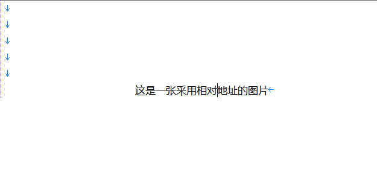
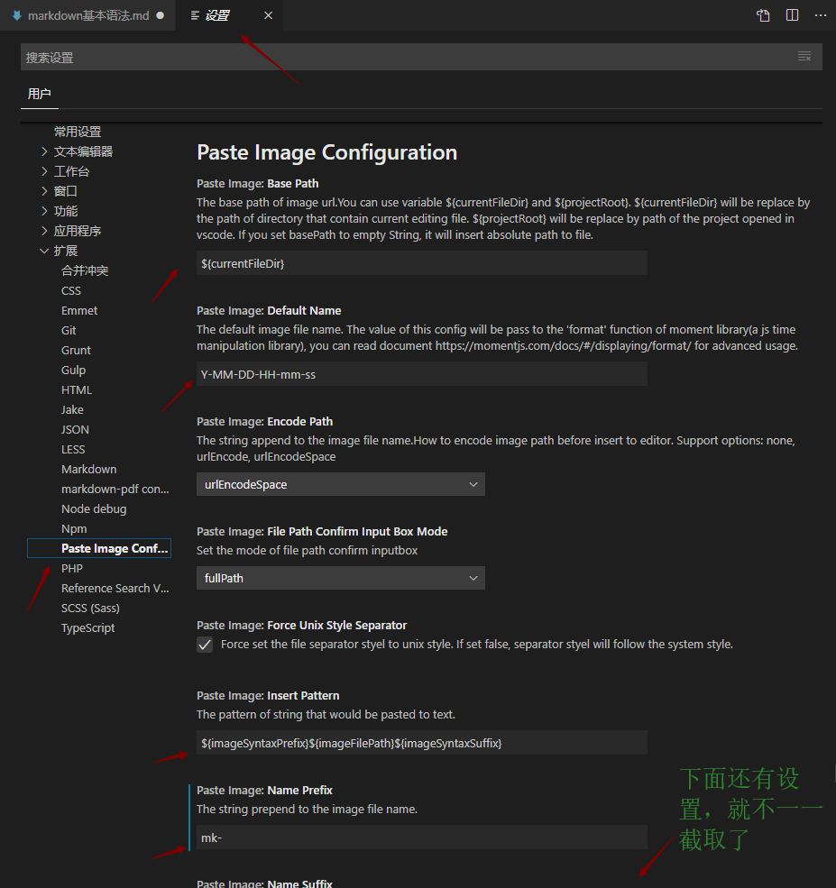

# 一.标题
    markdown通过在文字前面加# （#后面要加个空格）来表示标题，一个#是一级标题，两个#是二级标题，最多支持六级标题

示例：
# 这是一级标题
## 这是二级标题
### 这是三级标题
#### 这是四级标题
##### 这是五级标题
###### 这是六级标题
    # 这个#前面有tab，所以他不是一个标题
#这个#后面没有空格所以他在某些编辑器不被识别为标题

# 二.字体
1.加粗：要加粗的字体左右两边分别使用两个\*包起来  
示例：**这是加粗的字**  
2.斜体：要倾斜的文字左右分别用一个\*包起来  
示例：*这是倾斜的文字*  
3.粗斜体：要倾斜和加粗的文字左右分别用三个\*包起来  
示例：***这是倾斜加粗的文字***  
4.删除线：要加删除线的文字左右分别用两个~包起来  
示例：~~这是加了删除线的文字~~  

# 三.引用
在引用的文字前面加> （>后面要有空格）即可。也可以使用嵌套，加两个、三个>>  
示例：
> 这是引用的内容
>> 这是引用内容中的引用内容
# 四.分割线
使用三个或者三个以上的-或者*都可以形成分割线  
示例：  
以下是三个\*形成的分割线
***
以下是四个\*形成的分割线
****
以下是三个\-形成的分割线  

---
以下是四个\-形成的分割线  

----
# 五.图片
语法：!\[图片alt](图片地址 "图片title")  
图片alt是图片无法显示时的提示文字，相当于对图片内容的解释  
图片地址如果是绝对地址要在地址前面加/，比如C:\Users\wxr\Desktop\1.jpg应该写成/C:\Users\wxr\Desktop\1.jpg  
图片title就是图片的标题，当鼠标移动到图片上时会显示的内容，可不加  
示例：  
  
  
  
在VSCode中，我添加了Paste Image插件，截图后可以使用Ctrl+Alt+V快捷键进行粘贴，相关设置见下图  

# 六.超链接
语法：\[超链接名](超链接地址,"超链接title")  
title可省略  
示例：[这是一个到百度的超链接](http://www.baidu.com "这是超链接的title")  
# 七.列表
## 1. 无序列表
语法：无序列表使用\-、\+、\*（符号后面都要带空格）中的任意一个都可以  
示例：  
以下是使用\-的无序列表  
- 列表内容一
- 列表内容二
- 列表内容三
---
以下是使用\+的无须列表  
+ 列表内容四
+ 列表内容五
+ 列表内容六
---
以下是使用\*的无序列表
* 列表内容七
* 列表内容八
* 列表内容九
## 2. 有序列表
语法：数字加\.（\.后面要加空格）  
示例：  
1. 列表内容1
2. 列表内容2
3. 列表内容3
## 3. 列表嵌套
语法：上一级和下一级之间敲三个空格
- 一级无须列表一
   - 二级无须列表1
   - 二级无须列表2
   - 二级无须列表3
- 一级无须列表二
   1. 二级有序列表一
   2. 二级有序列表二
   3. 二级有序列表三

1. 一级有序列表一
   - 二级无须列表1
      - 三级
   - 二级无须列表2
   - 二级无须列表3
2. 一级有序列表二
   1. 二级有序列表一
   2. 二级有序列表二
   3. 二级有序列表三
# 八.表格
语法：  
表头|表头|表头  
\--|:\---\:\|\--:  
内容|内容|内容  
内容|内容|内容  
说明：
1. 第二行使用\-和\:分割表头和内容，\-只要有一个就行，写多个是用了美观；\:的作用是标识文字的对齐格式  
2. 文字默认居左，\-两边加:表示文字居中，\-右边加：表示文字居右
3. 原生的语法两边都要使用|包起来，此处省略  

示例：  
姓名|年龄|性别
--:|:--:|:--
|wxr|25|男|
外星人|225|女
示例2：
居左的文字|居中的文字|居右的文字
-|:-:|-:|
给我居左|给我居中|给我居右
# 九.代码
语法：
   1. 单行代码之间用一个反引号`包起来
   2. 代码块之间分别用三个反引号```包起来，且三个反引号需单独占用一行  
 
单行代码示例：  
`int i = 0;`

代码块示例：  
```
public static void main(String[] args)
  {
    int i = 1;
    String str = "hello world!";
    System.out.println(str + i);
}
```
# 十.流程图

待补充

# 十一.转义字符
以下字符在markdown语法中属于关键字符，如需直接输出需要转义，转义方式为在字符前面加\  
\\ 反斜杠  
\` 反引号  
\* 星号  
\_ 下划线  
\{\} 大括号  
\[\] 中括号  
\(\) 小括号  
\# 井号  
\+ 加号  
\- 减号  
\. 英文句号  
\! 感叹号  