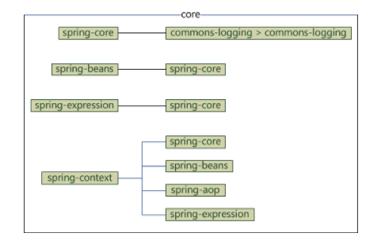

## 1.Spring的依赖关系
   1. spring-core：commons-logging
   2. spring-beans：spring-core
   3. spring-expression：spring-core
   4. spring-context：spring-core、spring-beans、spring-aop、spring-expression

## 2. BeanFactory容器
## 3. ApplicationContext容器
    常用的ApplicationContext容器：
* FileSystemXmlApplicationContext：该容器从XML文件中加载已被定义的bean，创建容器是需要提供给构造器XML文件的完整路径。
* ClassPathXmlApplicationContext：该容器从XML文件中加载已被定义的bean，创建容器时不需要提供XML文件的完整地址，只需要正确配置CLASSPATH环境变量即可，容器会从CLASSPATH中搜索bean配置文件。
* WebXmlApplicationContext：该容器会在一个web应用程序的范围内加载在XML文件中已被定义的bean。