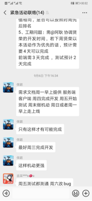
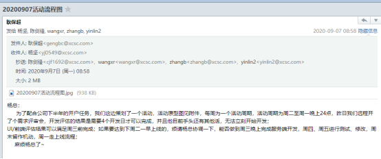
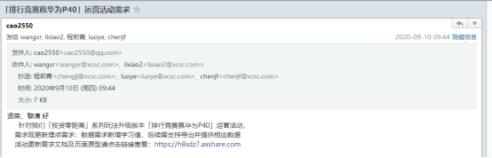
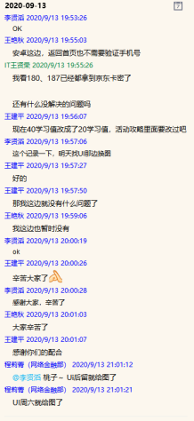
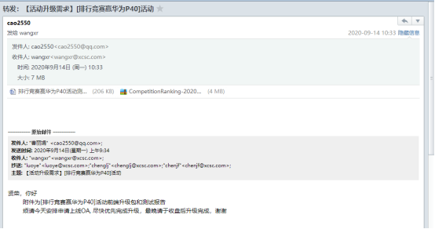
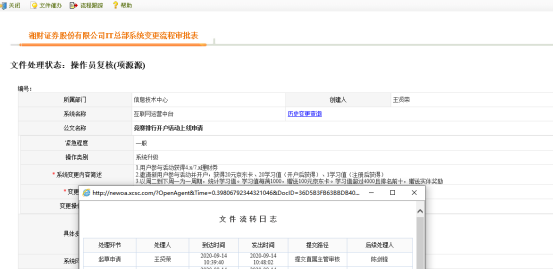
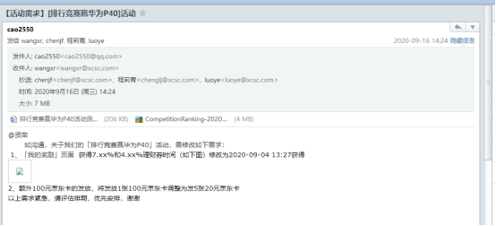
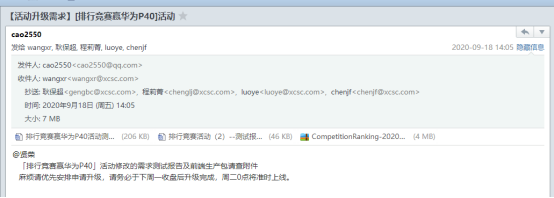
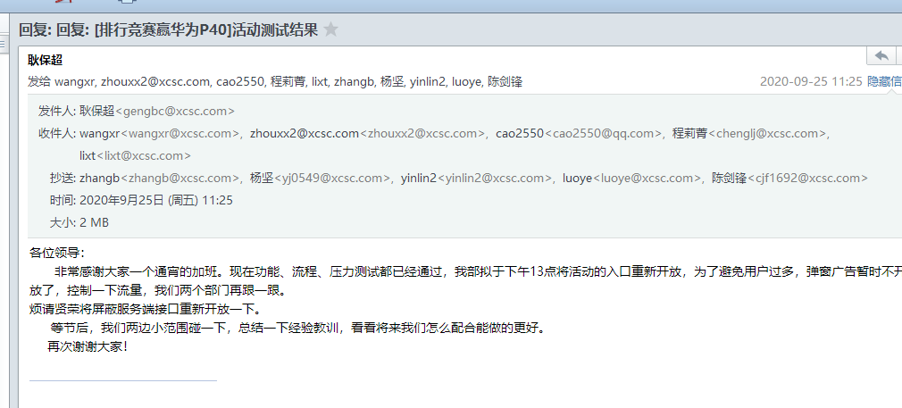
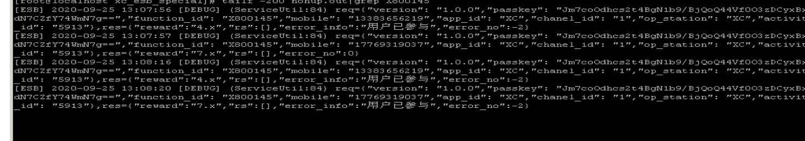

# 
**竞赛排行活动复盘**

# 2020年9月6日
1. 中午11点39分接到网金李贤滔电话，说有紧急需求需要临时讨论。当时在外面吃饭，另约下午14点腾讯会议。
2. 下午14点，腾讯会议讨论需求。李贤滔、曹丽娟、周新秀、张碧辉、戴成亮参会。15点30左右会议结束，暂时评估后端开发工作量为4人天。耿保超会议结束后微信群发言，周一提供网金需求文档，周四完成开发，周五测试，周一走流程上线。后又补充最好周三完成开发，该点未达成一致。  

# 2020年9月7日
1. 早上耿保超邮件杨坚、陈剑锋、张彬、尹林、王贤荣，邮件附流程图，无需求文档，请杨总协调安排周三完成开发。杨总及时找我了解情况。在完成早间系统检查后，我向杨总汇报了工作量评估细节及因OA宕机问题需要跟踪，无法确保周三完成开发。锋哥安排黎潇黎工协助开发，进入开发阶段。  

# 2020年9月9日
1. 早上曹丽娟发了需求文档（期间需求时有变化，也有通过通过微信群等途径发布需求文档，但是版本繁多）。
2. 下午，黎工提供接口文档，开始前后端联调。

# 2020年9月11日
1. 上午，曹丽娟微信群通知，百宝湘测试环境已发布活动，开始测试。
2. 截止晚上21点测试未完成，测试组沟通后决定第二天继续测试。因黎工周六有事，不能参与测试，黎工与王贤荣交接代码。

# 2020年9月12日
1. 上午9点30分，测试开始。当天未完成测试。

# 2020年9月13
1. 上午9点30分继续测试，晚上21点测试完毕，测试组结论为通过。  

# 2020年9月14日
1. 上午10点10分，曹丽娟邮件发送测试报告及生产包；

2. 10点50分，王贤荣发起上线流程，当天因流程审批未完成，没有升级。网金考虑到活动周期为周二到下周一，要求下周一再上线。

# 2020年9月16日
1. 下午14点半，网金提出需求变更，将周期结算每满1000学习值赠送1张100元京东卡，变更为赠送5张20元京东卡。  

# 2020年9月18日
1. 14点5分，曹丽娟邮件提供测试报告；  

2. 14点40分，王贤荣更新上线流程，重新流转到主要负责人审批；
3. 2020年9月21日18点30分，升级完成。

# 2020年9月22日
1. 下午13点30分，曹丽娟反馈有客户邀请他人参与活动并成功开户后没有获得京东卡和学习值。
2. 14点38分，定位问题为开户系统接口返回不对。
3. 17点52分，确认问题为开户系统接口查询主表为短信发送表，百宝湘渠道新增意见登录功能后，该部分客户在短信发送表无数据，故接口返回不对。将bug提交思迪后，告知程莉菁、曹丽娟原因。计划本周修复。

# 2020年9月23日
1. 13点，曹丽娟反馈有客户邀请7个开户成功，收到140元京东卡，应该有140个学习值，但是实际学习值只要49。实际查询邀请3人开户成功，当前学习值为76。根据客户截图显示，获得京东卡140元，与实际不符。
2. 14点，确认问题为：被邀请人开户成功后，定时任务多次给邀请人发送了京东卡。排查日志、数据库数据、程序，最终确认问题为上一次定时任务未执行完，下一次定时任务就开始跑引起，期间已将定时任务时间间隔由2分钟改为5分钟。
3. 20点，在余洋军余工帮助下修复定时任务问题。
    >活动上线后，截止查询时，开户736户，即应发京东卡736张，实发2166张，多发1430张。经程莉菁确认后，收回391张未激活京东卡，即最终多发1039张京东卡。

4. 因程莉菁要求，修改参与活动、邀请好友、查询是否参与过活动、被邀请用户完成注册四个接口，暂时不让客户急需参与。
5. 23点40分，接口改造、前端改造、测试完成，升级完成。

# 2020年9月24日
1. 10点10分，程莉菁反馈用户点击激活京东卡没有反应，查看日志，报错获取京东卡失败。查询京东卡表状态为未发放的京东卡有1700左右，判断为发卡时序列跳过了这些京东卡，于是将这些京东卡的编号改到序列之后，让程序重新轮询发放。
2. 下午13点54，程莉菁反馈客户绑定京东卡时提示已经被绑定过了;
3. 15点10分左右，定位问题如下：
   - 本次活动京东卡发放后没有将状态置为已发放
   - 上午报错京东卡获取失败后，我将状态为未发放实际已发放的京东卡编号改到序列之后，导致一张京东卡发放了两次。
4. 处理已发放但状态为未发放京东卡后，告知程莉菁、李贤滔。查询数据，共有166张京东卡发放了两次。
5. 15点40时，准备重新测试，因网开接口无法调用（华能机房搬迁，开户测试环境虚拟化，部分应用还没有调整好），测试暂停。
6. 20点30分，恢复测试，发现开户接口返回有问题（配置文件配置错误），因无法进入应用目录，reboot虚拟机，重启失败，改用另一台服务器上非常老的代码，接口可以返回，但返回参数不对。联系李宏亮重启虚拟机，重启后继续测试。

# 2020年9月25日
1. 早上5点30分，业务测试完成。
2. 上午10点10分，对被邀请人开户后，邀请人获得多张京东卡的问题再次进行复测，测试结果符合预期，邀请人只获得一张京东卡，确认bug已修复。
3. 11点25分，耿保超邮件确认测试通过，要求下午13点放开被屏蔽的四个接口。

4. 13点10分，王贤荣修改配置文件，重启服务后原被屏蔽接口已可正常访问。

5. 14点20分，查看数据
   - 邀请人开户后，被邀请人只获得一张20元京东卡，正常
   - 邀请老用户，不获得学习值，正常
   - 一张京东卡重复发放，未再出现，正常
   - 京东卡发放后状态被置为已发放，正常
   - 20元京东卡剩余1850张  
6. 后续持续跟踪数据、日志
   
# 总结
1. 在任务非常紧迫的条件下如何保证开发的质量？必须坚持需求评审与设计的评审，最关键的技术要点做好评估，并重点测试，减少代码Bug；
2. 测试场景进行充分思考，并进行相关测试；
3. 需求的对接要统一人员，不能因为非常紧急就直接对接开发。