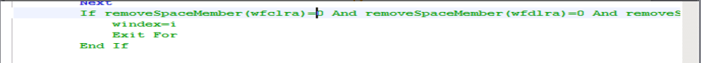

# <center>**综合办公系统近期故障维护报告**</center>
## 一.服务器问题
### （一）OA1服务器宕机
1. 故障时间：2020年4月1日16:45（最近一次）  
  恢复时间：2020年4月1日18:61
2. 故障记录：OA1服务器每隔12~30日出现宕机情况，日志抛出错误：
    ```
    [ 1] 0x7790bd7a ntdll.ZwWaitForSingleObject+10 (EB8FC543C1,30b5ec9,3,4b3a9a0)
    [ 2] 0x7FEFDA310AC KERNELBASE.WaitForSingleObjectEx+156 (5,5,0,25c0)
    @[ 3] 0x00ea6a17 nnotes.FRSendCommandToService+1943 (24bd8a00,24bd8d18,0,ea2d00)
    @[ 4] 0x00eaa300 nnotes.OSRunExternalScript+5860 (3,5,312d484,1)
    @[ 5] 0x00ea3b2d nnotes.FRTerminateWindowsResources+2277 (FFFFFFF00000000,0,0,0)
    @[ 6] 0x00ead2ca nnotes.OSFaultCleanupExt+622 (0,ea2ec7,150014,3131590)
    @[ 7] 0x00eadd41 nnotes.OSFaultCleanup+29 (42500012AA1,6b,42500012AA1,6b)
    @[ 8] 0x00ec78c6 nnotes.OSNTUnhandledExceptionFilter+626 (24bdb570,0,1,0)
    [ 9] 0x7783bc10 kernel32.UnhandledExceptionFilter+352 (24bdb570,6,0,7FE00000001)
    …….
    thread 78/266: [   nHTTP:  12f8:  1744] FATAL THREAD
    ```
3. 原因分析：操作系统内存和CPU监控无异常，分析错误日志，怀疑有http请求执行后台Lotusscript代码逻辑错误导致服务器内存溢出造成宕机。
4. 解决方法 & 注意点
   - 排查过程
     - 首次出现该情况时，查看日志未发现异常，怀疑是OA服务长时间不重启引发，新增了重启OA服务的定时任务，未有作用
     - 通过查看多次的宕机前后日志、domino异常日志，定位异常可能是由rssp.nsf引起的，但无法进一步定位异常代码
     - 新增domino日志输出配置，收集更多更全面的报错日志
     - 通过查看多次的宕机前后日志、domino异常日志，定位异常是rssp.nsf中撤回流程（从多个环节撤回）的代码引起的
     - 测试环境模拟重现，优化rssp.nsf撤回流程相关代码，测试宕机问题不在出现
     - <font  color="red">优化所有流程库撤回流程相关代码（已完成）</font >
   - 升级手册
     - 脚本Common的(Declareations)中粘贴以下代码
        ```
        Function removeSpaceMember2(srca As Variant) As Variant
            On Error Goto errhandle
            Dim ret() As String
            Dim i As Long, n As Long
            If Not Isarray(srca) Then
                If Isempty(srca(i)) Then
                Elseif Isnull(srca(i)) Then
                Elseif Trim(Cstr(srca(i)))="" Then
                Else
                    Redim Preserve ret(1)
                    ret(1) = srca			
                End If
                removeSpaceMember2 = ret
                Exit Function
            End If
            
            n = 0
            For i=0 To Ubound(srca)
                If Isempty(srca(i)) Then
                Elseif Isnull(srca(i)) Then
                Elseif Trim(Cstr(srca(i)))="" Then
                Else
                    n = n + 1
                    Redim Preserve ret(n)
                    ret(n) = srca(i)			
                End If
            Next
            If n = 0 Then
                Redim Preserve ret(0)
                ret(0) = ""
                removeSpaceMember2 = ret
            Else
                removeSpaceMember2 = ret
            End If
            Exit Function
        errhandle:
            Msgbox "common->removeSpaceMember2 " & Erl & ":" & Error
            'Call ErrorSend("1","Common->removeSpaceMember2","","")
        ```
   - 代理Flow_Rollback方法processRollback 注释以下代码

并在相同位置添加一下代码
        ```
        Dim ary1, ary2, ary3 As Variant
        ary1 = removeSpaceMember2(wfclra)
        ary2 = removeSpaceMember2(wfdlra)
        ary3 = removeSpaceMember2(puclr1)
        If UBound(ary1)=0 And UBound(ary2)=0 And UBound(ary3)=0 Then
            windex=i
            Exit For
        End If
        ```
### （二）OA1宕机重启后，一致性检查时间长达两小时甚至更久
1. 故障时间：2020年4月1日16:45（最近一次）  
恢复时间：2020年4月1日18:61
2. 原因分析：异常重启Domino后，系统为保护数据完成性会自动对数据库逐一做一致性检查操作，检查时间过久是由于数据库数量多且文件容量过大导致。
3. 解决办法 & 注意点：应该避免不正常OA宕机操作，一旦出现此类情况，管理员应该立即切换备机上线，把对用户的操作影响降低到最少。等待重启完成后，Domino会自动开启群集服务，同步主服务器和备机的数据一致。
### （三）主备OA数据不同步
1. 原因分析：经排查数据库，部分数据库存在复本ID不一致的情况，怀疑以前存在不正确的数据库拷贝操作，导致复本关系建立失败，无法正常数据同步。另有部分数据库复本ID一致，其中仍有部分数据无法正常同步，初步判断和历史冗余数据过多有关，数据超过了同步合法期限导致无法正常同步。
2. 解决方法 & 注意点：重建备OA数据。考虑到现有服务器环境以及生产环境的需要，建议增加一台OA群集服务器，以OA1的数据做基础，对新服务器做完整群集复制操作，为保证数据完整性，建议复制时OA1服务器Domino停止运行
## 二.代码问题
### （一）OA前端代码兼容性问题导致非IE浏览器提交异常
1. 发现时间：2020年3月27日16:30左右（最近一次）  
恢复时间：2020年3月27日18:23
2. 故障记录：非IE浏览器做提交操作时，控制台显示js报错
3. 原因分析：浏览器技术更新，原有前台页面在新浏览器中不被兼容，导致无法正常工作。
4. 解决方法 & 注意点：搭设测试环境，排查原有代码错误，替换不兼容代码。
### （二）长工号2.非IE浏览器登录OA异常
1. 故障时间：2020年3月17日13:58  
恢复时间：2020年3月17日15:15
2. 故障记录：用户长工号显示登陆失败，用户名密码错误
3. 原因分析：分析代码，原系统判断了输入工号情况下，自动截取后四位数字代码。
4. 解决方法 & 注意点：更改判断逻辑，去除自动截取操作。
### （三）非IE浏览器直接访问邮箱主页调整异常
1. 故障1)时间：2020年2月17日13:00左右  
恢复时间：2020年2月17日15:26
2. 故障记录：IE浏览器访问邮箱主页停留在首页取数界面
3. 原因分析：分析代码，原系统邮箱主页跳转代码设置有误，无法兼容全浏览器。
4. 解决方法 & 注意点：重写跳转代码
### （四）OA提交异常，导致重复提交，待办重复
1. 故障1)时间：2020年3月19日9：49  
恢复时间：2020年3月19日10:00
2. 故障记录：用户出现同一流程重复待办记录
3. 原因分析：经了解，个别用户报告出现此类情况，对流程数据观察并无数据错误，开发环境模拟相同操作，未出现类似情况，怀疑和生产系统繁忙时段网络环境和用户异常操作有关。
4. 解决方法 & 注意点：对用户提交操作后按钮做禁用，避免重复点击事件。
## 三.现存问题
1. 主备库数据同步异常
2. 代码兼容性、可重用性差
3. 流程库设计不合理导致库大小接近上限
4. 日志输出不合理，监控手段匮乏
5. <font color="red">开发依赖IBM客户端，效率低</font>
## 四.短期计划
1. 解决数据同步问题，先处理备机数据（20200411），再新建一台服务器（使用ssd磁盘），替换现有主机；
2. 大库拆库（新设备到位后处理）
3. 增加domino内存、CPU使用率等监控项